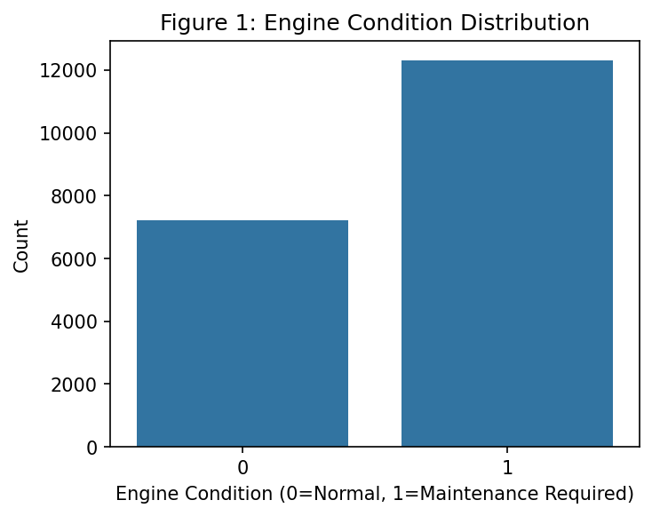
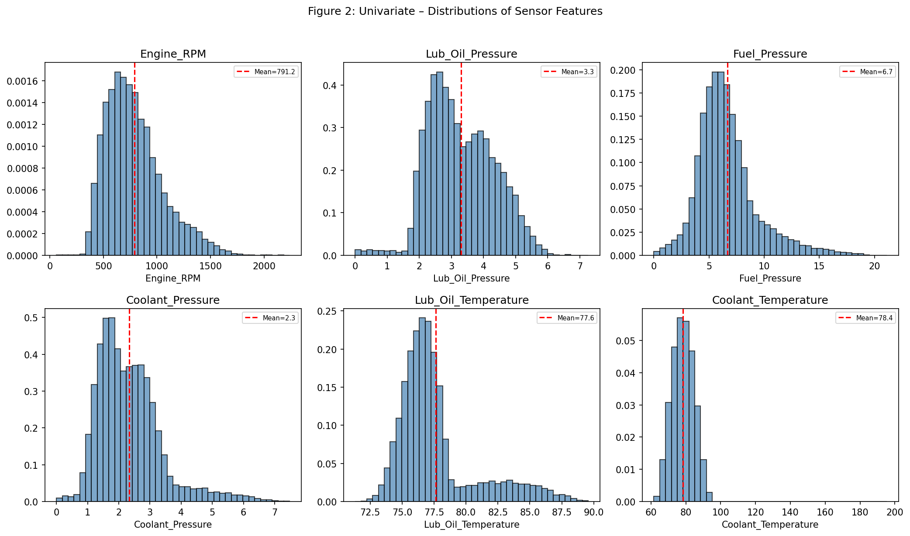
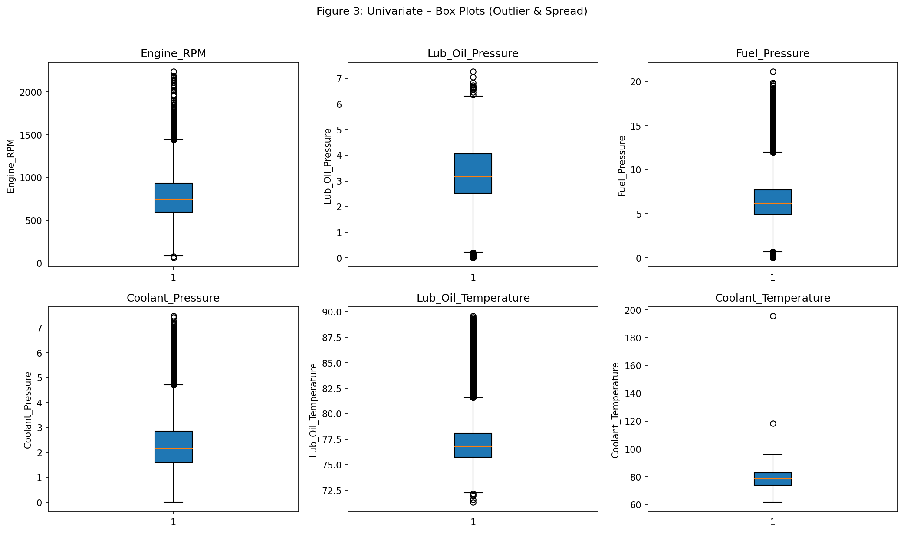
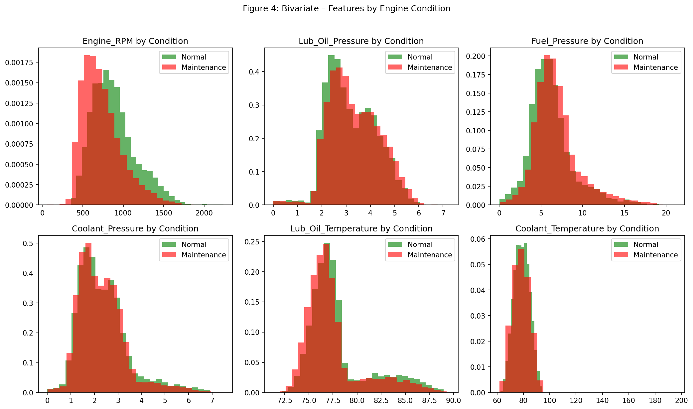
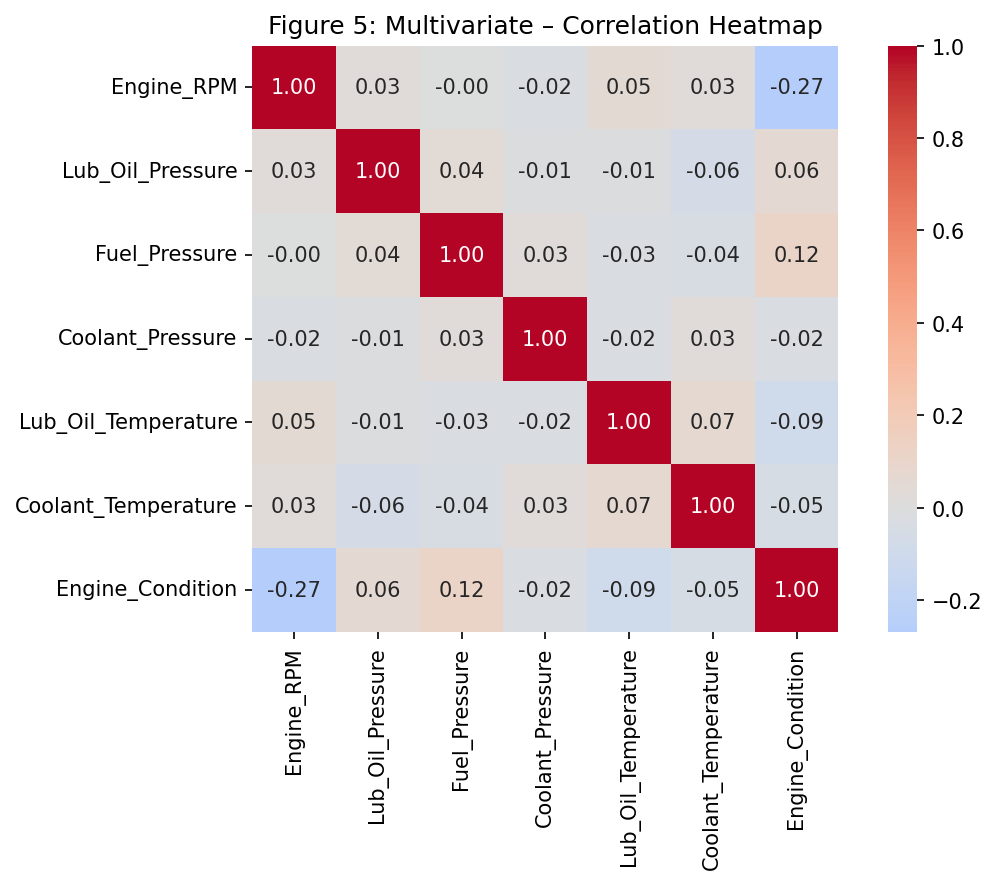

# Interim Project Report
## Engine Predictive Maintenance – MLOps Pipeline

**Learner Name:** Anant Tripathi  
**Project Name:** Engine Predictive Maintenance  
**Date:** February 2026

---

## 1. Executive Summary

This interim report presents the progress of an end-to-end MLOps pipeline for **Engine Predictive Maintenance**. The pipeline automates data registration, exploratory data analysis, data preparation, and model building with experimentation tracking. The system classifies engine conditions (Normal vs. Maintenance Required) using sensor data and deploys the trained model for real-time predictions.

---

## 2. Data Registration

### 2.1 Methodology

A master folder structure is created with a `data` subfolder. The raw engine sensor dataset is registered on the Hugging Face Dataset Hub at `ananttripathiak/engine-maintenance-dataset` using the `data_register.py` script. This enables version control, reproducibility, and seamless integration with downstream pipeline steps.

### 2.2 Implementation

- **Master folder:** `engine_maintenance_project/`
- **Data subfolder:** `engine_maintenance_project/data/`
- **Dataset:** `engine_data.csv` (19,535 rows × 7 columns)
- **Hugging Face Repo:** [ananttripathiak/engine-maintenance-dataset](https://huggingface.co/datasets/ananttripathiak/engine-maintenance-dataset)

### 2.3 Business Implication

Centralized data registration reduces manual errors, ensures consistency across experiments, and supports collaboration. Version-controlled datasets enable audit trails and reproducibility for compliance and quality assurance.

---

## 3. Exploratory Data Analysis

### 3.1 Data Collection and Background

The engine sensor dataset contains real-time measurements from various engines under different operating conditions. Data is collected from sensors monitoring critical engine parameters indicative of engine health and maintenance needs.

### 3.2 Data Overview

| Metric | Value |
|--------|-------|
| Rows | 19,535 |
| Columns | 7 |
| Missing Values | None |
| Data Types | All numerical (float64, int64) |

**Features:** Engine_RPM, Lub_Oil_Pressure, Fuel_Pressure, Coolant_Pressure, Lub_Oil_Temperature, Coolant_Temperature  
**Target:** Engine_Condition (0: Normal, 1: Maintenance Required)

### 3.3 Univariate Analysis

**Figure 1: Engine Condition Distribution**

- Normal (0): 36.9%
- Maintenance Required (1): 63.1%
- **Observation:** Moderate class imbalance; stratified sampling recommended.

**Figure 2: Univariate Distributions of Sensor Features**

- All features are continuous with varying ranges.
- Engine_RPM shows wider spread; pressure and temperature sensors have narrower distributions.
- No extreme skewness detected; StandardScaler appropriate for normalization.

**Figure 3: Box Plots – Outlier Detection**

- Some outliers present in pressure and temperature readings; median imputation used for any future missing values.

### 3.4 Bivariate Analysis

**Figure 4: Bivariate Analysis – Features by Engine Condition**

- Features show different distributions between Normal and Maintenance Required classes.
- Temperature and pressure readings are key discriminators.
- **Business Insight:** Real-time sensor monitoring can enable proactive maintenance scheduling.

### 3.5 Multivariate Analysis

**Figure 5: Correlation Heatmap**

| Feature | Correlation with Target |
|---------|-------------------------|
| Fuel_Pressure | 0.12 |
| Lub_Oil_Pressure | 0.06 |
| Coolant_Pressure | -0.02 |
| Coolant_Temperature | -0.05 |
| Lub_Oil_Temperature | -0.09 |
| Engine_RPM | -0.27 |

**Observation:** Engine_RPM has the strongest (negative) correlation with maintenance need. Lower RPM combined with abnormal pressure/temperature patterns may indicate fault conditions.

### 3.6 EDA Insights and Observations

1. **Data Quality:** No missing values; all numerical features.
2. **Class Balance:** Normal 36.9% vs Maintenance 63.1% – stratified split used.
3. **Predictive Potential:** Features show different distributions by target.
4. **Key Indicators:** Temperature and pressure sensors are critical.
5. **Recommendations:** Use stratified train-test split; apply StandardScaler; consider Random Forest or XGBoost for classification.

---

## 4. Data Preparation

### 4.1 Methodology

- Load data from Hugging Face or local file
- Clean: rename columns, drop duplicates, handle missing values (median imputation)
- Split: 80% train, 20% test, stratified by target
- Save locally and upload train/test splits to Hugging Face dataset repo

### 4.2 Results

| Split | Size |
|-------|------|
| Train | 15,628 |
| Test | 3,907 |

Train and test datasets saved as `data/train.csv` and `data/test.csv` and uploaded to the Hugging Face dataset repository.

### 4.3 Business Implication

Proper data preparation ensures model generalizability. Stratified splitting preserves class distribution, and versioned datasets support reproducible model retraining.

---

## 5. Model Building with Experimentation Tracking

### 5.1 Methodology

- **Algorithm:** Random Forest Classifier
- **Preprocessing:** StandardScaler (scikit-learn Pipeline)
- **Hyperparameter Tuning:** RandomizedSearchCV (12 iterations, 3-fold CV, F1 scoring)
- **Experiment Tracking:** MLflow (parameters, metrics, artifacts)
- **Model Registry:** Best model saved locally and uploaded to Hugging Face Model Hub

**Hyperparameter Search Space:**
- n_estimators: [100, 200, 300]
- max_depth: [None, 10, 20]
- min_samples_split: [2, 5]
- min_samples_leaf: [1, 2]

### 5.2 Best Parameters

| Parameter | Value |
|-----------|-------|
| n_estimators | 300 |
| max_depth | 10 |
| min_samples_split | 5 |
| min_samples_leaf | 1 |

### 5.3 Model Performance Metrics

| Metric | Train | Test |
|--------|-------|------|
| Accuracy | 0.77 | 0.66 |
| F1-Score | 0.83 | 0.76 |
| ROC-AUC | — | 0.70 |

### 5.4 Classification Report (Test Set)

| Class | Precision | Recall | F1-Score | Support |
|-------|-----------|--------|----------|---------|
| Normal | 0.57 | 0.35 | 0.43 | 1,444 |
| Maintenance | 0.69 | 0.85 | 0.76 | 2,463 |
| **Accuracy** | | | **0.66** | **3,907** |
| Macro Avg | 0.63 | 0.60 | 0.60 | 3,907 |
| Weighted Avg | 0.65 | 0.66 | 0.64 | 3,907 |

### 5.5 Confusion Matrix (Test Set)

|  | Predicted Normal | Predicted Maintenance |
|--|------------------|------------------------|
| **Actual Normal** | 504 | 940 |
| **Actual Maintenance** | 377 | 2,086 |

### 5.6 Business Implications

- **Recall for Maintenance (0.85):** The model correctly identifies 85% of engines requiring maintenance, reducing risk of missed failures.
- **Precision for Maintenance (0.69):** Some false positives; acceptable for preventive maintenance where over-inspection is preferable to missed failures.
- **ROC-AUC (0.70):** Moderate discriminative ability; room for improvement with additional features or alternative algorithms.

---

## 6. Conclusion

The interim pipeline successfully implements:
1. **Data Registration** on Hugging Face
2. **Comprehensive EDA** with univariate, bivariate, and multivariate analysis
3. **Data Preparation** with train/test splits and versioning
4. **Model Building** with Random Forest, hyperparameter tuning, MLflow tracking, and Hugging Face model registration

The model achieves a test F1-score of 0.76 and ROC-AUC of 0.70, with strong recall for the maintenance class. The pipeline is ready for deployment and GitHub Actions automation in the final submission.

---

## Appendix

*Raw code, full model logs, and extended outputs are available in the accompanying HTML notebook: `AnantTripathi_EnginePredictiveMaintenance_Notebook.html`.*

---

*Page 1 of 1*
