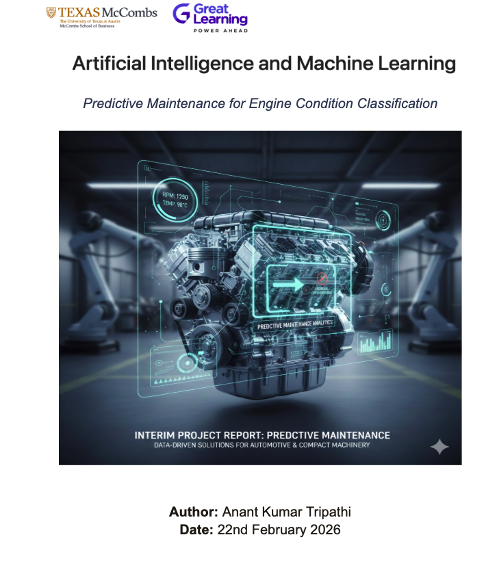

# Engine Predictive Maintenance



---

## Overview

This project implements an **end-to-end MLOps pipeline** for **engine predictive maintenance**: classify engine condition (Normal vs Maintenance Required) from sensor readings (RPM, lubricating oil pressure, fuel pressure, coolant pressure, oil and coolant temperatures). The pipeline covers data registration, exploratory data analysis, data preparation, model building with experimentation tracking (MLflow), model deployment (Streamlit on Hugging Face Spaces), and automated workflows (GitHub Actions).

## Repository structure

| Path | Description |
|------|-------------|
| `Engine_PM_Interim_Notebook_final.ipynb` | Main notebook: EDA, prep, training, deployment, and report sections |
| `engine_pm_project/data/` | Raw data folder (e.g. `engine_data.csv`) |
| `engine_pm_project/model_building/` | Scripts: `data_register.py`, `prep.py`, `train.py` |
| `engine_pm_project/deployment/` | Dockerfile, Streamlit `app.py`, `requirements.txt`, `deploy_to_hf_spaces.py` |
| `.github/workflows/pipeline.yml` | CI: register-dataset → data-prep → model-training → deploy-hosting |

## Links

| Resource | Link |
|----------|------|
| **GitHub repository** | [github.com/ananttripathi/engine-pm-project](https://github.com/ananttripathi/engine-pm-project) |
| **Hugging Face Space (Streamlit app)** | [huggingface.co/spaces/ananttripathiak/engine-pm-streamlit](https://huggingface.co/spaces/ananttripathiak/engine-pm-streamlit) |
| **Hugging Face dataset** | [huggingface.co/datasets/ananttripathiak/engine-pm-data](https://huggingface.co/datasets/ananttripathiak/engine-pm-data) |
| **Hugging Face model** | [huggingface.co/ananttripathiak/engine-pm-model](https://huggingface.co/ananttripathiak/engine-pm-model) |

## Running the notebook

```bash
cd /path/to/Interim_Submission
jupyter nbconvert --to notebook --execute --inplace Engine_PM_Interim_Notebook_final.ipynb
```

Place `title_page.png` in the same directory as the notebook so the image displays correctly.

## Deployment

- **Streamlit app:** The Space runs the app in `engine_pm_project/deployment/` (Docker). It loads the model from the Hugging Face model hub and predicts from six sensor inputs.
- **CI:** Push to `main` runs the pipeline; set **HF_TOKEN** in GitHub Secrets for data/model/Space uploads.

## License

See repository for license information.
